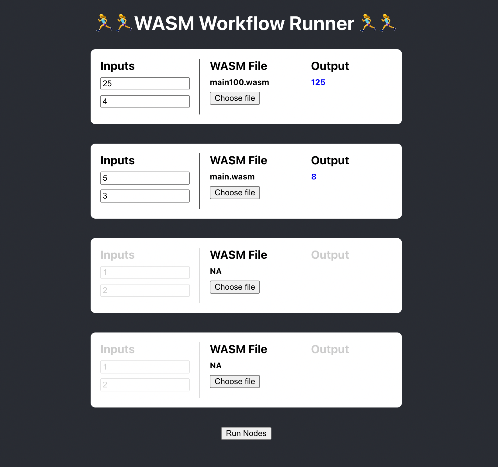

# WASM executor

This is a simple POC that does the following:
* has a web application client that allows user to select WASM files from the file system
* turns those files to byte arrays
* contains a server side program that has an endpoint accepting those WASM files as byte arrays
* uses Wasmtime to execute the WASM file
* returns the calculation result back to the client that made the call

In addition it does:
* provide the WASM a few imported functions, these could represent side effects such as database persistance
* those above mentioned functions can be async, so good for side effects

It does not do yet:
* is not cleaned up at all
* provide SDK for the consumers to be aware of those side effects
* allow adding and removing nodes that represent steps in the workflow
* make a connection between the nodes, so that an output would be used at the subsequent step

