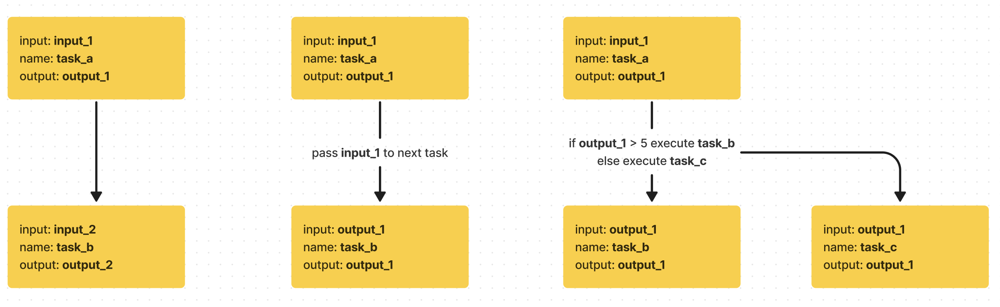

<h1> Workflow Manager </h1>

* [Responsibilities of this crate](#responsibilities-of-this-crate)
* [modules](#modules)
  * [Flow](#flow)
    * [Features](#features)
      * [Later](#later)
  * [Task](#task)
    * [Features](#features-1)

## Responsibilities of this crate

* define the types for the workflows
* have a tooling for object -> JSON -> object for workflows
* provide types/utils that are usable in the frontend for composing workflows
* orchestrate the execution of the tasks in the workflows by the wasm_executor
* contains a few modules relating to flows

## modules

### Flow

Flow is the most top level unit for composing the workflows. It has a name,
description, a starting point and it contains one of more tasks. When the flow
contains 2 or more tasks, they are executed in sequence (or later parallel).

In the sequence of executing the tasks, the relationship between the tasks can
be:

* when task_a completes task_b is executed
* when task_a completes task_b is executed with task_a's output as an input to
  task_b
* when task_a completes, an if/else statement based on task_a's output is
  executed to decide which task is run next. output data from task_a can be used
  as an input.

#### Features

* flow must have a name
* flow can have a description
* flow can have an initial value that can be passed in to the first task
* every task can have fixed inputs or inputs passed in by the flow
  * flow can pass an output of previous task's output to the next task
  * flow can pass the flow's initial value to the first task
* every task can use the output of previous task as an input if the types are
  matching
* after every task there can be if/else or if/if/else statement to decide the
  next node
* the whole flow has an output
* if a task errors that error should be persisted as an output to the whole flow
  with an indication of the error

##### Later

* flows can be chained and composed as tasks, they will follow the same
  interface as tasks

* flow
  * define a flow
  * modifying flow
  * basic info (name, description, tasks)
  * connections between tasks
    * coordination for inputs/outputs and passing on the values
    * coordinations for control flow (if, else, for loop)
  * persisting exposing the task inputs/outputs
  * persisting of the performed flows

### Task

#### Features

* task must have a name
* task can have a description
* task has a definition:
  * defines a signature that must much with the signature of the WASM
  * defines whether the task is sync or async
* task contains an executable WASM file2
* task contains an executable WASM file2
